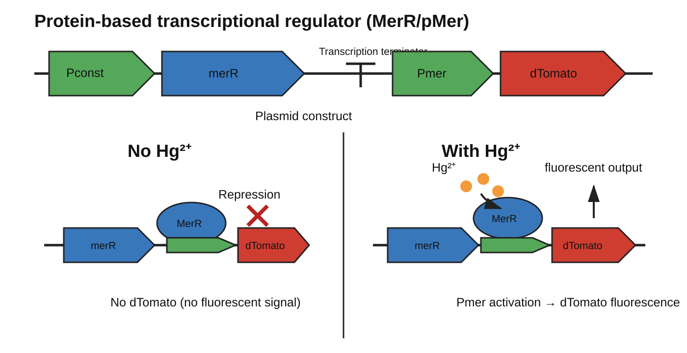
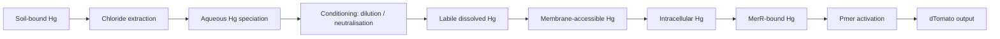

# MerR–Hg(II) Computational Chemistry Workflow

**Mechanistic modelling of Hg(II) speciation, ligand exchange, and transfer into the MerR Hg-binding site for an E. coli whole-cell mercury biosensor.**

> Project context: iGEM 2026 — soil mercury sensing using chloride-based extraction coupled to an **E. coli + MerR/pMer + dTomato** reporter circuit.



## Why this repository exists

The difficult part of a MerR whole-cell mercury sensor is not simply whether MerR can bind Hg(II). The real engineering problem is whether Hg extracted from soil in a chloride-rich chemical environment can be converted into a near-neutral biological assay environment while retaining enough **MerR-accessible Hg** to generate a strong and reproducible reporter response.

A chloride extract may contain Hg as a mixture of `HgCl+`, `HgCl2(aq)`, `HgCl3-`, `HgCl4^2-`, hydrolysed species such as `HgOH+` / `Hg(OH)2(aq)`, and complexes with dissolved organic matter or sulfur ligands. Therefore:

> **HgCl2 reagent added ≠ HgCl2 is the equilibrium species ≠ Hg is membrane-accessible ≠ Hg reaches MerR.**

This repository builds the computational layer needed to separate these steps rather than treating all dissolved Hg as equivalent.

## Biological circuit being modelled

The team circuit is:

```mermaid
flowchart LR
    A[Pconst] --> B[merR]
    B --> C[MerR protein]
    C --> D[Pmer]
    H[MerR-accessible Hg(II)] --> C
    D --> E[dTomato]
    E --> F[Fluorescence]
```

Without Hg(II), MerR keeps `Pmer` in the non-activated/repressed state. After Hg(II) coordinates to MerR, the MerR–DNA complex is shifted into the transcriptionally active state and `Pmer` drives dTomato fluorescence.

The computational chemistry in this repository focuses on the step:

```text
conditioned aqueous Hg species
            ↓
Hg transfer / ligand exchange
            ↓
MerR Cys-rich Hg-binding site
```

It does **not** by itself predict final fluorescence. Whole-cell output also depends on membrane transport, intracellular ligands, cell physiology, transcription, translation, dTomato maturation and the optical readout.

## Core scientific goal

The central question is:

> **How thermodynamically and kinetically accessible is Hg(II) transfer from environmentally relevant aqueous Hg complexes to the MerR Hg-binding site under conditions compatible with an E. coli biosensor?**

The target is therefore **MerR-accessible Hg**, not preservation of one reagent identity such as `HgCl2`.

An end-to-end model is:



Conceptually,

`Observed signal ∝ extraction × dissolved fraction × labile fraction × uptake × MerR activation × reporter efficiency`.

The present code addresses mainly the **speciation / lability / Hg→MerR transfer** portion of this chain.

## Questions this workflow is designed to test

1. Is transfer of Hg from `HgCl2`, `HgCl3-`, `HgCl4^2-` and hydroxo-Hg to a MerR-like thiolate site thermodynamically favourable?
2. How does chloride concentration change the **conditional** driving force for Hg transfer?
3. Can very high chloride keep Hg dissolved while making transfer to MerR less accessible?
4. After neutralisation and chloride reduction, can hydrolysed Hg remain chemically transferable to MerR?
5. Which species merit expensive full-protein QM/MM calculations?
6. If transfer chemistry is favourable but the cell signal is weak, does the bottleneck move upstream to membrane uptake, DOM/sulfur binding or toxicity?
7. Which `[Cl-] × pH` region should be mapped experimentally first?

A strongly stable final Hg–MerR state does **not** prove that the state is reached quickly. Equilibrium thermodynamics and ligand-exchange kinetics are therefore treated separately.

## What “binding strength” means here

For Hg–MerR, one docking score is not enough.

### 1. Transfer free energy

`ΔG_transfer` asks whether Hg thermodynamically prefers the aqueous ligand environment or a thiolate-rich MerR-like site.

### 2. Conditional free energy

`ΔG = ΔG° + RT ln Q`

This introduces solution composition such as chloride concentration. The first implementation uses activity ≈ concentration only as a screening approximation. Quantitative high-ionic-strength work should later use a suitable activity model such as SIT or Pitzer.

### 3. Activation barrier

`ΔG‡` controls how rapidly ligand exchange occurs. A transfer can be thermodynamically favourable but too slow on the biosensor assay timescale.

The long-term target is a free-energy surface connecting Hg–Cl coordination to Hg–S coordination.

## Why ordinary docking is not the main method

Hg(II)–MerR is a metal–thiolate coordination problem involving Hg–S bond formation, Hg–Cl bond breaking, charge transfer, strong polarisation, ligand protonation, solvation of charged species, coordination-number changes and relativistic effects for Hg. A generic docking score or non-relativistic classical `Hg2+` parameter is not a defensible quantitative affinity estimate.

The workflow therefore starts with **relativistic solvated DFT**, and only after the small-system chemistry is stable does it escalate to **protein-level QM/MM enhanced sampling**.

## Structural reference

The default reference is the experimentally determined Hg-bound **Tn501 MerR structure, PDB 5CRL**. The code can fetch the structure, identify Hg and nearby cysteine sulfur donors, measure Hg–S distances, and build a methylthiolate site mimic from the experimental geometry.

For project-specific prediction, the team’s exact MerR amino-acid sequence/construct should be added and aligned against this reference. AlphaFold can be used as an auxiliary structural hypothesis tool, but it is not used here as a substitute for binding thermodynamics.

## Current screening model

The first-stage model includes:

- `HgCl2`
- `HgCl3-`
- `HgCl4^2-`
- `Hg(OH)2`
- `Cl-`
- `OH-`
- `MeS-` as a cysteine-thiolate chemical mimic
- `[Hg(SMe)3]-` as a simplified trigonal MerR-like product

Screening cycles include:

`HgCl2 + 3 MeS- -> [Hg(SMe)3]- + 2 Cl-`

`HgCl3- + 3 MeS- -> [Hg(SMe)3]- + 3 Cl-`

`HgCl4^2- + 3 MeS- -> [Hg(SMe)3]- + 4 Cl-`

`Hg(OH)2 + 3 MeS- -> [Hg(SMe)3]- + 2 OH-`

These are controlled thermodynamic comparison cycles, **not claims that the protein literally follows one-step reactions of this form**.

## Computational architecture

### Level 0 — solution speciation

Target design space: approximately pH 2–8, chloride `1e-4`–`1 M`, and trace-to-µM Hg relevant to the assay. This should ultimately produce the abundance of candidate Hg–Cl / Hg–OH species under each conditioned sample condition.

### Level 1 — relativistic DFT screening

Default ORCA setup:

- `PBE0-D4`
- scalar-relativistic `ZORA`
- light atoms: `ma-ZORA-def2-TZVP/TZVPP`
- Hg: `SARC-ZORA-TZVP/TZVPP`
- `CPCM(Water)`
- geometry optimisation + frequency, followed by a higher-basis single-point calculation

The output is intended for **relative transfer thermodynamics**, not an experimentally exact absolute `Kd`.

### Level 2 — sensitivity analysis

Key calculations should be repeated with justified changes in functional, solvation model, basis size, explicit first-shell waters, ligand protonation hypotheses and starting geometries. If a conclusion reverses under reasonable model choices, it should be reported as unresolved.

### Level 3 — full MerR QM/MM

After small-cluster ranking is stable, prepare the full MerR dimer and put Hg, the three coordinating cysteine side chains, directly bound Cl/OH/H2O and critical first-shell interactions into the QM region; protein, solvent and ions remain MM.

### Level 4 — enhanced sampling

The intended collective variables are approximately:

`CV1 = CN(Hg-Cl)`

`CV2 = CN(Hg-S)`

Umbrella sampling or well-tempered metadynamics can then estimate a free-energy surface `F[CN(Hg-Cl), CN(Hg-S)]`, including reactant basin, intermediates, transition region, final Hg–S state, `ΔG_transfer`, and `ΔG‡`.

### Level 5 — experiment/model closure

Compare computational predictions with a whole-cell response matrix varying final chloride, pH, Hg concentration and selected matrix components. Weak reporter output must be separable into poor extraction/recovery, chemical inaccessibility, uptake limitation, general toxicity or MerR-specific effects.

## Roadmap

### Phase 0 — reference structure and reproducibility

- [x] use Hg-bound MerR reference `5CRL`
- [x] automate Hg/Cys donor inspection
- [x] generate a protein-derived site mimic
- [ ] add exact team MerR amino-acid sequence
- [ ] align the exact construct against 5CRL
- [ ] document exact coordinating cysteine numbering

### Phase 1 — small-cluster Hg chemistry

- [x] generate `HgCl2`, `HgCl3-`, `HgCl4^2-`, `Hg(OH)2` starting structures
- [x] generate a MerR-like thiolate product model
- [x] generate ORCA relativistic DFT jobs
- [x] parse electronic/thermal energies
- [x] calculate standard transfer free energies
- [x] calculate first-pass chloride/pH conditional corrections
- [ ] run production calculations on suitable compute infrastructure
- [ ] perform functional / basis / solvation sensitivity analysis

### Phase 2 — solution chemistry integration

- [ ] integrate verified Hg–Cl / Hg–OH equilibrium constants
- [ ] generate `[Cl-] × pH` speciation maps
- [ ] add activity corrections for high ionic strength
- [ ] connect species fractions to DFT transfer energetics
- [ ] calculate a first MerR-accessibility index
- [ ] later add selected DOM / thiol / sulfide competition

### Phase 3 — protein-level energetics

- [ ] prepare complete MerR dimer
- [ ] determine relevant protonation states
- [ ] solvate and ionise the system
- [ ] define and validate QM region
- [ ] validate stable Hg–S3 geometry
- [ ] test candidate Hg donor species in the protein environment

### Phase 4 — ligand-exchange kinetics

- [ ] define robust Hg–Cl and Hg–S coordination-number CVs
- [ ] run pilot umbrella/metadynamics calculations
- [ ] estimate free-energy barriers
- [ ] identify mechanistically meaningful intermediates
- [ ] compare chloride and hydroxo pathways

### Phase 5 — couple computation to the biosensor

- [ ] experimentally map final `[Cl-] × pH` response surface
- [ ] run clean-buffer and matrix-matched controls
- [ ] measure cell-health / expression controls separately from MerR activation
- [ ] compare reporter output with model-predicted MerR accessibility
- [ ] identify whether chemistry, uptake, toxicity or transcription is limiting
- [ ] use the result to choose the simplest conditioning workflow for the portable hardware

## Repository structure

```text
.
├── README.md
├── run.py
├── requirements.txt
├── assets/
│   └── merR_pMer_dTomato_circuit.svg
├── config/
│   ├── config.yaml
│   └── reactions.yaml
├── mercury_merr/
│   ├── cli.py
│   ├── fetch.py
│   ├── geometry.py
│   ├── orca.py
│   ├── orca_parse.py
│   ├── pdbtools.py
│   ├── species.py
│   └── thermo.py
├── scripts/
│   └── run_orca_all.sh
└── templates/
    ├── cp2k_qmmm_notes.txt
    └── plumed.dat
```

Generated `structures/`, `jobs/` and `results/` directories are intentionally ignored by Git.

## Installation

Requirements: Python 3.10+, packages in `requirements.txt`, ORCA 6.x for the DFT stage, and later CP2K + PLUMED for QM/MM / enhanced sampling.

```bash
python -m venv .venv
source .venv/bin/activate  # Windows: .venv\Scripts\activate
pip install -r requirements.txt
```

## Quick start

```bash
# Fetch and inspect experimental Hg-bound MerR
python run.py fetch
python run.py inspect-site structures/5CRL.pdb --cutoff 3.2
python run.py build-site-mimic structures/5CRL.pdb --out structures/5CRL_site_mimic.xyz

# Build screening species and ORCA jobs
python run.py build-species --outdir structures/species
python run.py gen-orca --structures structures/species --jobs jobs

# Run ORCA after setting its executable
export ORCA=/path/to/orca
./scripts/run_orca_all.sh

# Parse and analyse
python run.py parse-orca
python run.py thermo
```

Expected analysis outputs include `results/energies.csv`, `reaction_dG0.csv`, chloride-dependent conditional free energies, pH-dependent conditional free energies and plots.

## How to interpret results

The high-value first result is the **relative ranking** of Hg donor environments, not a single absolute affinity number.

- If `HgCl4^2-` has a less favourable transfer free energy or larger barrier than `HgCl2`, very high chloride may preserve dissolved Hg while reducing MerR accessibility.
- If hydroxo-Hg remains transferable to the thiolate site, neutralisation-driven hydrolysis does not automatically imply loss of sensing.
- If all transfer reactions are favourable but the whole-cell signal is weak, uptake, DOM/sulfur binding, toxicity or reporter physiology may dominate instead.

Never interpret an endpoint DFT energy as direct proof of cellular uptake or final fluorescence.

## Connecting the model to the extraction workflow

```text
high-Cl soil extraction
        ↓
Hg-Cl-rich extract
        ↓
solid/liquid separation
        ↓
conditioning: dilution + pH/ionic-strength normalisation
        ↓
new Hg equilibrium distribution
        ↓
membrane-accessible Hg
        ↓
MerR-accessible Hg
        ↓
dTomato signal
```

The working hypothesis is **not** “HgCl2 must be preserved”. A more defensible target is:

`f_MerR-accessible = Hg capable of reaching/binding MerR on the assay timescale / total dissolved Hg`.

The roadmap aims to approximate this with solution speciation + transfer energetics + kinetic barriers, then validate it experimentally.

## Planned experimental interface

A weak signal should be diagnosable using separate controls for extraction recovery, Hg remaining dissolved after conditioning, general cell health / expression, MerR-specific response, clean Hg standards, and matrix-matched calibration standards. The computation is intended to guide those controls, not replace them.

## Major limitations

The current workflow does not on its own establish true E. coli membrane uptake, intracellular Hg activity, an experimental-accuracy absolute MerR `Kd`, `Pmer` kinetics, dTomato maturation, reporter LOD/EC50, real DOM/sulfide/biothiol competition, surface adsorption losses, or high-ionic-strength non-ideal activities. Conclusions should therefore be labelled as **model-supported**, **context-dependent**, or **experimentally validated** rather than collapsed into one category.

## Falsification rules

The model is explicitly intended to challenge the chloride-extraction + MerR design. Treat a result as weak if it depends strongly on one functional/basis set, if alternative solvation/protonation models reverse it, if protein-level results disagree with the cluster model, or if experimental `[Cl-] × pH` trends do not follow the predicted ordering. Disagreement is itself useful evidence for missing chemistry or an upstream biological bottleneck.

## Immediate next steps

1. Add the exact MerR amino-acid sequence used by the team.
2. Map its coordinating cysteines against Tn501/5CRL.
3. Add the real final assay buffer, pH and chloride range after soil-extract conditioning.
4. Run the first ORCA production set plus sensitivity analysis.
5. Integrate verified Hg–Cl / Hg–OH equilibrium constants.
6. Select the top chemically relevant species for full-protein QM/MM.
7. Compare the predicted ordering with a controlled whole-cell `[Cl-] × pH` response matrix.

## Current status

**Code:** first-stage workflow implemented; production quantum-chemistry calculations require an ORCA-capable compute environment.

**Science:** hypothesis-generating / mechanism-screening. No claim is yet made that the code predicts an absolute MerR binding constant or whole-cell response.

**Project-specific data still needed:** exact MerR sequence, E. coli strain, `Pmer` operator/promoter sequence, assay composition and the final conditioned soil matrix.
